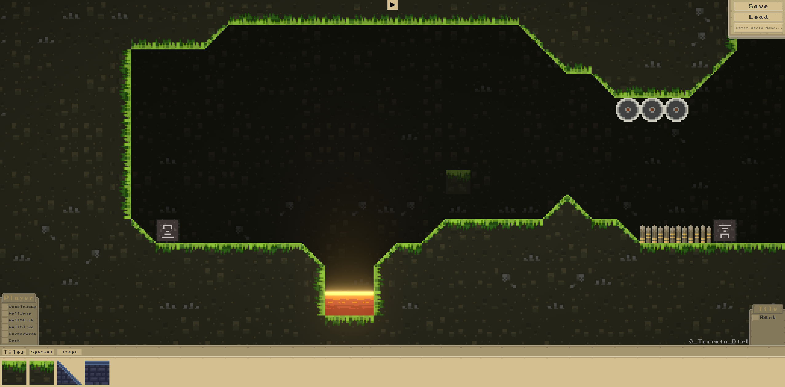

# Platformia

> Platformia is a toolkint developed for Unity that allows to quickly prototype your own platformer game. It contains everything that you need to create basic platformer game. It is designed so that it is easy to use and does not require any line of code. It also has a powerful runtime level editor.


## :video_game: Gameplay

[](http://www.youtube.com/watch?v=hOIJQ3127k0 "Gameplay")

Player can:

```sh
DoubleJump, WallJump, WallStick, WallSlide, CornerGrab, Dash
```

## :hammer: Runtime Level Editor

> Editor is a runtime and has implemented layers system. It will allow players to create levels in game. Allowing your gamer community to create levels will not only increase their satisfaction, but it will also save your time. You can also use this level editor to create levels yourself and save them.

## :clipboard: Meta

Spartak Gevorgyan – artak10t@gmail.com

Distributed under the GNU General Public License v3.0 license. See ``GNU General Public License v3.0`` for more information.

[https://github.com/artak10t/github-link](https://github.com/artak10t/)
