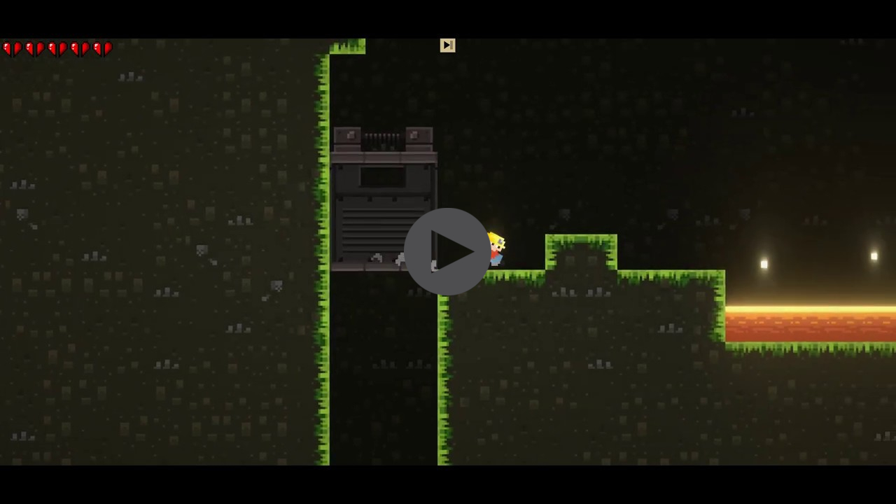

# The Mad Miners


> The Mad Miners is a platformer game developed on Unity, and the game was inspired by the Super Meat Boy. The game contains everything that you need to create basic platformer game. It is designed so that it is easy to use and does not require any line of code. It also has an ingame level editor.


## Gameplay

[](http://www.youtube.com/watch?v=hOIJQ3127k0 "The Mad Miners - Gameplay")

Player can:

```sh
DoubleJump, WallJump, WallStick, WallSlide, CornerGrab, Dash
```

Windows:

```sh
edit autoexec.bat
```

## InGame Editor

A few motivating and useful examples of how your product can be used. Spice this up with code blocks and potentially more screenshots.

_For more examples and usage, please refer to the [Wiki][wiki]._

## Adding Content

Describe how to install all development dependencies and how to run an automated test-suite of some kind. Potentially do this for multiple platforms.

```sh
make install
npm test
```

## Meta

Spartak Gevorgyan – artak10t@gmail.com

Distributed under the GNU General Public License v3.0 license. See ``GNU General Public License v3.0`` for more information.

[https://github.com/artak10t/github-link](https://github.com/artak10t/)
